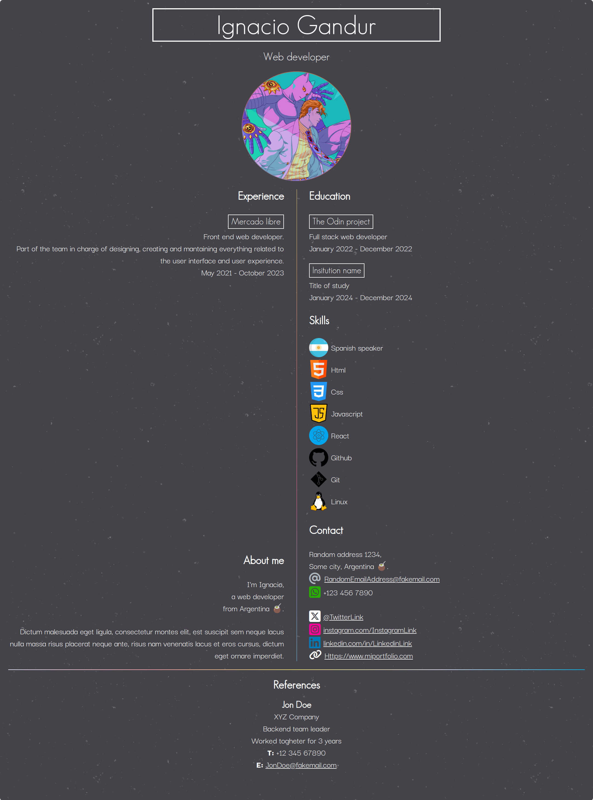

# CV Generator Application

Create stunning and personalized curriculum vitae effortlessly. This web application allows you to craft a standout CV with decorative backgrounds, download it as a PDF with retained aesthetics, and showcase your professional and personal information in a visually appealing manner.

## Features:

-   ### Decorative backgrounds:
    Choose from a variety of decorative backgrounds to give your CV a unique and stylish look. Stand out from the crowd with visually appealing designs that reflect your personality. You can pick between light and dark themes.
-   ### PDF download with decorative elements:
    Download your CV as a high-quality PDF file while preserving all the decorative elements, including background images, colors, and links. Ensure that your CV looks as impressive in print as it does on the screen.
-   ### Social media integration:
    Include links to your social media accounts directly in your CV. Showcase your professional presence on platforms like LinkedIn and GitHub, allowing recruiters and employers to connect with you easily.
-   ### Comprehensive sections:
    -   **Skills:** Highlight your key skills and areas of expertise to give employers a quick overview of your qualifications.
    -   **References:** Provide references from professional contacts to strenghten your credibility.
    -   **Education Background:** Display your academic achievements in a clear and organized manner.
    -   **Experience:** Showcase your work history with concise descriptions of your roles and accomplishments.
    -   **Personal Information:** Add a personal touch to your CV by including a brief section about yourself, helping employers get you know beyond your professional achievements.

## Language customization:

Choose between English and Spanish for your CV presentation. Tailor your content to match your preferred language and effectively communicate with a broader audience.

## How to use:

1. Visit [This page] (https://ignaciogandur.github.io/cv-application/).
2. **Select language:** Choose between english or spanish for your CV presentation.
3. **Customize your CV:** Fill in your details, select a decorative background, and tailor each section to match your profile.
4. **Preview your CV:** Take a look at how your CV will appear with the selected background and content.
5. **Download as PDF:** Once satisfied, click on the download button in the top right corner. **READ** and follow the instructions to download the CV correctly.

Elevate your job application with a visually appealing and professionally crafted CV using CV Generator. Your story deserves to be presented in style!

### Examples:

[Sample pdf file](./examples/example-cv.pdf)
